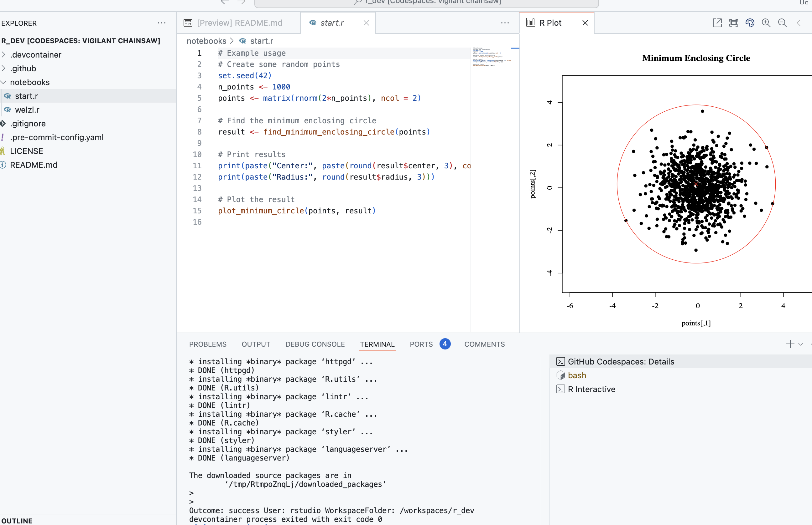

# R dev

Create a DevContainer for R.

[](https://codespaces.new/tschm/r_dev)




## Instructions

Fire up the construction of the DevContainer by [Open in GitHub Codespaces](https://codespaces.new/tschm/r_dev)

Pick a suitable configuration. Please note that you pay for the server.
You need a GitHub account.

The container downloads the tidyverse image and installs required software and a few packages.
Follow the progress in the terminal.

Once in VS Code you have to source the [welzl.r](notebooks/welzl.r) file. Use the hollow arrow in the top right corner. Or

```bash
source("/workspaces/r_dev/notebooks/welzl.r", encoding = "UTF-8")
```

in the terminal.

It remains to start [start.r](notebooks/start.r) and play with the input parameter.

Rather than solving the problem directly using the intersection of cones it applies an idea by [Welzl](https://en.wikipedia.org/wiki/Emo_Welzl)

## Reasoning

Containers guarantee a certain level of computational harmony when multiple users use tools like Python or R.
The container is essentially a pre-cooked meal providing R and the VS Code editor out of the box. Adding support
for RStudio will be done in the next step.
